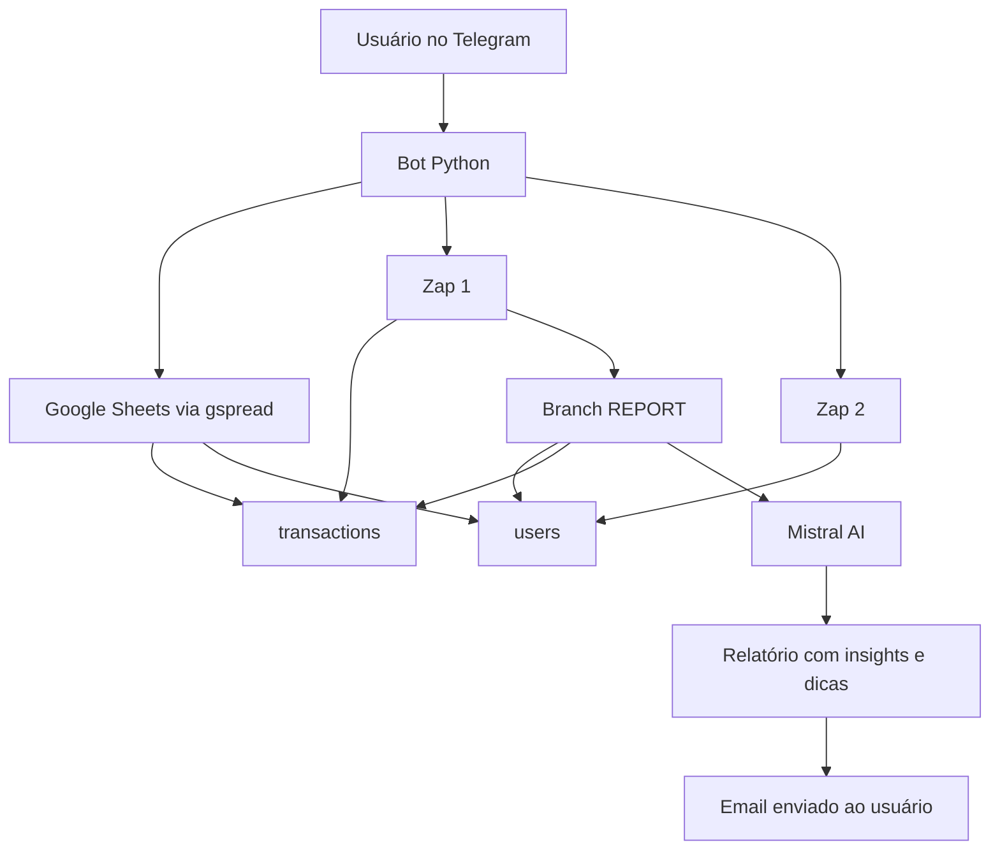
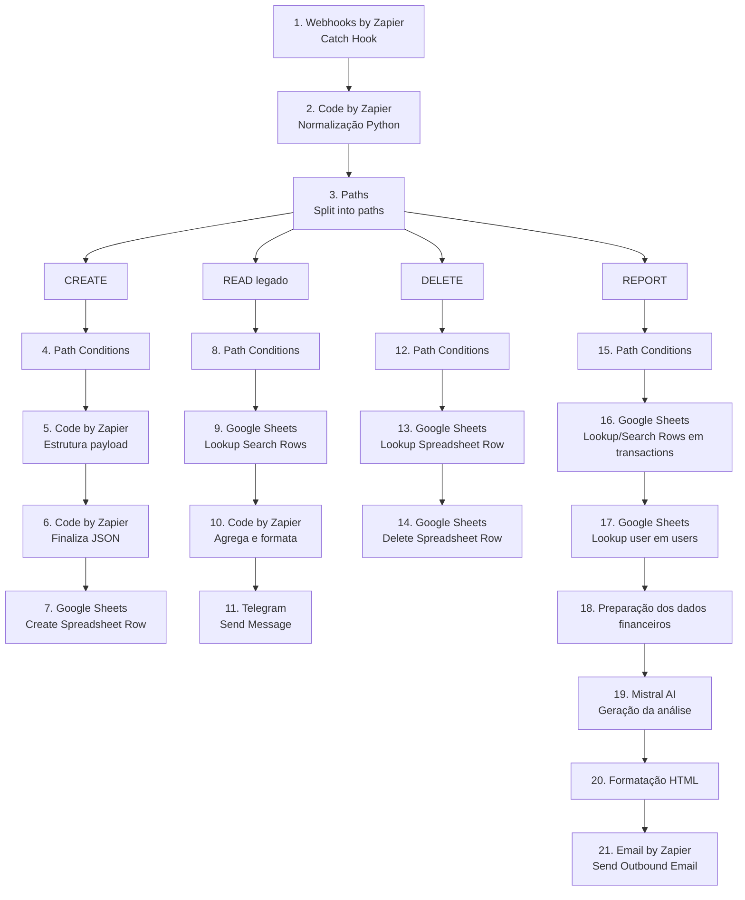
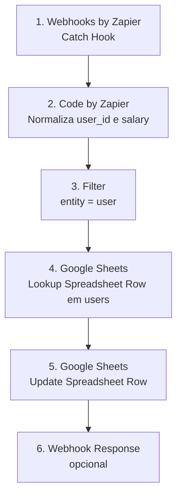

# 🤖🦎 ChamaLeon — Assistente Financeiro no Telegram

**LINK:** https://web.telegram.org/a/#8729145296

O **ChamaLeon** é um bot de finanças pessoais via Telegram. Hoje ele permite fazer onboarding com e-mail e salário, registrar transações, consultar histórico, ver um resumo mensal e gerar um relatório personalizado por e-mail.


O comportamento real do projeto hoje é:

- **Python** para o bot Telegram.
- **Google Sheets** como persistência das abas `transactions` e `users`.
- **Zap 1** para criar transações, deletar transações, manter um READ legado e gerar o relatório personalizado com IA.
- **Zap 2** para atualizar salário na aba `users`.
- **Mistral AI** usado dentro da branch `REPORT` do Zap 1 para gerar análise financeira textual.
- **Leitura direta com `gspread`** para histórico, verificação de onboarding, salário e resumo do mês.
- **Cache local em memória** com TTL curto para reduzir chamadas repetidas ao Google Sheets.

## ✨ Funcionalidades atuais

- Onboarding inicial com e-mail e salário.
- Registro rápido de transações via `/registro`.
- Suporte a gastos e recebimentos.
- Campo opcional de observação usando `|`.
- Histórico paginado no Telegram.
- Resumo mensal com salário, entradas, gastos e saldo disponível.
- Exclusão de transações pelo menu.
- Atualização de salário via Zap separado.
- Relatório financeiro personalizado por e-mail com base no salário e nas transações mensais do usuário.
- Alias `/dinheiro` funcionando como atalho para o resumo financeiro, usando a mesma lógica de `/salario`.

## 🧱 Arquitetura

### Sistema completo



### Zap 1

O Zap 1 é o fluxo principal. Ele recebe ações relacionadas a transações e relatório.

O relatório sai da branch `REPORT` do Zap 1.



### Zap 2

O Zap 2 é isolado para salário. Ele não deve processar transações nem relatório.



## Comandos implementados no código

- `/start`
- `/registro`
- `/historico`
- `/salario`
- `/dinheiro`
- `/relatorio`

Observação:

- `/dinheiro` é um alias funcional de `/salario`.
- Ambos exibem o resumo financeiro calculado em tempo real.

## Fluxo principal

### 1. Onboarding

Ao usar `/start`, o bot verifica se o `user_id` já existe na aba `users` e se já possui salário válido.

Se não existir ou estiver sem salário:

```text
/start
→ pedir e-mail
→ validar e-mail
→ pedir salário
→ salvar ou atualizar usuário na aba users via gspread
→ liberar menu principal
```

O onboarding inicial é salvo diretamente pelo bot usando `gspread`, sem passar pelo Zap 2.

### 2. Registro de transação

Exemplos:

```text
/registro ifood 39
/registro mercado 84 | compra do mês
/registro freelance 800 | projeto abril
```

O bot:

- extrai `description`, `amount` e `details`;
- detecta `category` e `type`;
- mostra confirmação;
- ao confirmar, envia o payload para o **Zap 1** com `action=create`;
- invalida o cache local de `transactions` e `salary_summary` após sucesso.

Payload enviado ao Zap 1:

```json
{
  "action": "create",
  "user_id": "7500965215",
  "description": "mercado",
  "details": "compra do mês",
  "amount": 84.0,
  "category": "Compras",
  "type": "expense",
  "date": "2026-05-06",
  "_source": "telegram_bot",
  "_timestamp": "2026-05-06T12:00:00",
  "_normalized": true
}
```

### 3. Histórico

O histórico atual **não depende do Zap 1**. O próprio bot:

```text
→ lê a aba transactions com gspread
→ filtra por user_id exato
→ pagina os resultados
→ exibe no Telegram
```

O READ do Zap 1 permanece como fluxo legado, mas o comportamento principal do bot usa leitura direta no Google Sheets.

### 4. Resumo mensal

Ao abrir o menu de dinheiro/salário, o bot:

```text
→ lê salary na aba users
→ lê transactions do mês atual
→ soma entradas e gastos
→ calcula saldo disponível
```

Fórmula usada hoje:

```text
saldo disponível = salário registrado + entradas do mês - gastos do mês
```

O resumo mensal aceita múltiplos formatos de data e valor vindos do Google Sheets, incluindo:

- `YYYY-MM-DD`
- `DD/MM/YYYY`
- ISO com hora
- serial date do Google Sheets
- `50`
- `50.00`
- `50,00`
- `R$ 50,00`

### 5. Atualização de salário

Fluxo:

```text
Usuário abre Meu Dinheiro / Meu Salário
→ clica em Registrar / Atualizar
→ informa o valor
→ Bot envia action=update_salary para o Zap 2
→ Zap 2 atualiza salary e updated_at na aba users
```

Payload enviado ao Zap 2:

```json
{
  "action": "update_salary",
  "user_id": "7500965215",
  "salary": 3500.0,
  "_source": "telegram_bot",
  "_timestamp": "2026-05-06T12:00:00"
}
```

### 6. Deleção de transação

Fluxo:

```text
Usuário clica em "Deletar Transação"
→ Bot mostra até 10 transações recentes do próprio usuário
→ Usuário seleciona uma
→ Bot confirma a escolha
→ Bot envia action=delete para o Zap 1
→ Zap 1 remove a linha no Google Sheets
```

Proteção lógica atual:

- o bot lista apenas transações filtradas pelo `user_id` do usuário atual;
- a confirmação usa um `transaction_id` vindo dessa lista;
- após delete bem-sucedido, o cache de `transactions` e `salary_summary` é invalidado.

Payload enviado ao Zap 1:

```json
{
  "action": "delete",
  "user_id": "7500965215",
  "transaction_id": "7500965215_20260506120000",
  "_source": "telegram_bot",
  "_timestamp": "2026-05-06T12:00:00"
}
```

### 7. Relatório por e-mail

O relatório atual é personalizado com base no salário e nas transações mensais do usuário, trazendo insights, dicas e apontamentos enviados para o e-mail cadastrado.

No desenho atual do sistema:

- o bot envia a solicitação com `action=report`;
- a branch `REPORT` do Zap 1 busca usuário e transações;
- o Code Step prepara totais, categorias, maiores gastos e sinais comportamentais;
- a Mistral AI gera a análise textual;
- o Zap formata o conteúdo em HTML;
- o relatório final é enviado por e-mail.

Payload enviado ao Zap 1:

```json
{
  "action": "report",
  "user_id": "7500965215",
  "_source": "telegram_bot",
  "_timestamp": "2026-05-06T12:00:00"
}
```

Se o webhook responder com sucesso, o usuário recebe a confirmação:

```text
Relatório solicitado
→ branch REPORT do Zap 1 continua o fluxo
→ relatório personalizado é enviado ao e-mail cadastrado
```

## 📊 Estrutura do Google Sheets

### Aba `transactions`

| Coluna | Campo | Descrição |
|---|---|---|
| A | `id` | ID único da transação |
| B | `user_id` | ID do usuário no Telegram |
| C | `date` | Data da transação |
| D | `description` | Descrição curta |
| E | `category` | Categoria |
| F | `amount` | Valor |
| G | `type` | `expense` ou `income` |
| H | `created_at` | Data de criação |
| I | `updated_at` | Data de atualização |
| J | `details` | Observações adicionais |

### Aba `users`

| Coluna | Campo | Descrição |
|---|---|---|
| A | `user_id` | ID do usuário no Telegram |
| B | `email` | E-mail para relatório |
| C | `registered_date` | Data de cadastro |
| D | `salary` | Salário base |
| E | `updated_at` | Última atualização |

## 🏷️ Categorias atuais

O bot usa keyword matching local para sugerir categoria e tipo.

| Exemplo | Categoria | Tipo |
|---|---|---|
| `ifood 39` | Alimentação | expense |
| `uber 25` | Transporte | expense |
| `mercado 300` | Compras | expense |
| `curso 100` | Educação | expense |
| `freelance 800` | Trabalho | income |
| `salário 3500` | Trabalho | income |
| sem match | Outros | expense |

Categorias suportadas no bot:

- Alimentação
- Transporte
- Entretenimento
- Saúde
- Educação
- Moradia
- Compras
- Outros

Observação:

- A branch `REPORT` do Zap 1 também pode normalizar categorias adicionais e sinais comportamentais para a análise financeira, como mercado + delivery, transporte privado alto, compras relevantes e entretenimento alto.

## 🧠 Relatório com IA

A branch `REPORT` do Zap 1 monta um payload financeiro com:

- salário;
- entradas do mês;
- gastos do mês;
- saldo final;
- percentual da renda comprometida;
- totais por categoria;
- maiores transações;
- sinais financeiros;
- sinais comportamentais.

A Mistral AI gera uma resposta estruturada em 5 partes:

1. Planilha resumida de gastos.
2. Diagnóstico financeiro.
3. Ajuste principal.
4. Novo cenário após ajuste.
5. Uso da sobra.

Regras principais do prompt:

- tratar inferências como hipóteses;
- não prometer resultado financeiro;
- não sugerir investimentos específicos;
- não fazer cortes agressivos em saúde ou educação;
- priorizar categorias variáveis como alimentação, transporte, compras e entretenimento;
- sugerir faixas de ajuste, não valores absolutos obrigatórios.

## 🧩 Cache local

O bot mantém um cache simples em `context.user_data["_cache"]`.

Configuração atual:

```text
TTL = 60 segundos
```

Chaves usadas:

| Chave | Uso |
|---|---|
| `transactions` | Histórico e deleção |
| `salary_summary` | Salário, entradas, gastos e saldo mensal |

Invalidações implementadas:

| Evento | Cache invalidado |
|---|---|
| Criação de transação | `transactions`, `salary_summary` |
| Deleção de transação | `transactions`, `salary_summary` |
| Atualização de salário | `salary_summary` |

## 🔐 Variáveis de ambiente

Crie um `.env` com:

```bash
TELEGRAM_BOT_TOKEN=seu_token

ZAPIER_WEBHOOK_EXPENSE=url_do_zap_1
ZAPIER_WEBHOOK_SALARY=url_do_zap_2

GOOGLE_SHEET_ID=id_da_planilha
GOOGLE_CREDENTIALS_PATH=caminho/para/credentials.json

SHEET_NAME=transactions
USERS_SHEET_NAME=users
```

Em produção/cloud, o bot também aceita:

```bash
GOOGLE_CREDENTIALS_JSON='{"type":"service_account",...}'
```

É necessário usar **uma** destas opções:

- `GOOGLE_CREDENTIALS_PATH`
- `GOOGLE_CREDENTIALS_JSON`

Observações importantes:

- A planilha precisa estar compartilhada com o e-mail da service account.
- Em cloud, `GOOGLE_CREDENTIALS_JSON` deve preservar corretamente as quebras de linha da `private_key`.
- O código corrige `\\n` para `\n` na chave privada antes de autenticar.

## ⚙️ Instalação

### Requisitos

- Python 3.10+
- Planilha com abas `transactions` e `users`
- Conta de serviço do Google com acesso à planilha
- 2 webhooks no Zapier
- Zap 1 publicado
- Zap 2 publicado

Templates dos Zaps:

- https://zapier.com/templates/details/zap-1-crud-principal-do-chamaleon-d65716?secret=MTp0ZW1wbGF0ZTpITGNCNFZiR0M5MmtCcDhLRUJXTW8zazViTHdOVXhfdVNzZFJabUV2ajFrOjF6MXdnNw
- https://zapier.com/templates/details/zap-2-atualizao-ou-adio-de-salrio-edf22f?secret=MTp0ZW1wbGF0ZTpYd1JkVVBFOXkxeDJQT3ZjdEVieWYtZmJoUm5UTmdfdmRfNy1lUWNUNWNvOjU1OW83eg

 
### Dependências

```bash
pip install -r requirements.txt
```

Dependências atuais do repositório:

```text
python-telegram-bot==21.1
requests==2.31.0
python-dotenv==1.0.0
gspread==5.12.0
```

Observação:

- O runtime importa `google.oauth2.service_account.Credentials`.
- Normalmente isso vem pelas dependências do `gspread`, mas se o ambiente acusar erro de importação relacionado a `google.oauth2`, instale ou adicione `google-auth` ao `requirements.txt`.

## ▶️ Execução local

```bash
python3 ChamaLeon_telegram.py
```

O bot roda em polling.

Apenas uma instância deve rodar por vez.

## 🚀 Deploy

O `Procfile` atual usa:

```text
worker: python ChamaLeon_telegram.py
```

Para subir em Railway, Render ou similar:

1. Configure as variáveis de ambiente.
2. Garanta que a planilha esteja compartilhada com a service account.
3. Garanta que os webhooks do Zapier estejam publicados.
4. Rode uma única instância do polling.
5. Verifique se o worker permanece ativo.
6. Confira logs de conexão com Google Sheets, Zap 1 e Zap 2.

## ⚠️ Lacunas e problemas atuais

- O relatório é disparado pelo bot, mas sua geração final depende da branch `REPORT` do Zap 1; este repositório cobre o disparo e o contrato do payload, não a implementação interna completa do e-mail.
- O estado da conversa fica em memória em `context.user_data`; um restart interrompe fluxos em andamento.
- Há logs de debug bem verbosos no runtime atual, inclusive com sinais de configuração e rastreamento detalhado de Sheets.
- Os webhooks do Zapier continuam sendo pontos sensíveis e precisam de proteção operacional adequada.
- O bot usa polling; portanto, não deve haver múltiplas instâncias rodando ao mesmo tempo.
- O READ do Zap 1 ainda existe como legado, mas o histórico principal do bot é lido diretamente via `gspread`.
- O projeto ainda usa Google Sheets como banco simplificado; para evolução, uma migração para Supabase/PostgreSQL continua sendo um próximo passo natural.

## ✅ Status consolidado

| Área | Status |
|---|---|
| Onboarding por e-mail e salário | Funcional |
| Registro de transações | Funcional |
| Campo `details` com `|` | Funcional |
| Histórico via Sheets | Funcional |
| Resumo mensal | Funcional |
| `/salario` | Funcional |
| `/dinheiro` | Funcional como alias de `/salario` |
| Deleção via Zap 1 | Funcional |
| Update de salário via Zap 2 | Funcional |
| Relatório por e-mail | Funcional no sistema integrado; disparado pelo bot e gerado no Zap 1 |
| Cache local | Implementado com TTL de 60 segundos |
| Estado persistente | Não implementado |
| Banco relacional | Não implementado |

