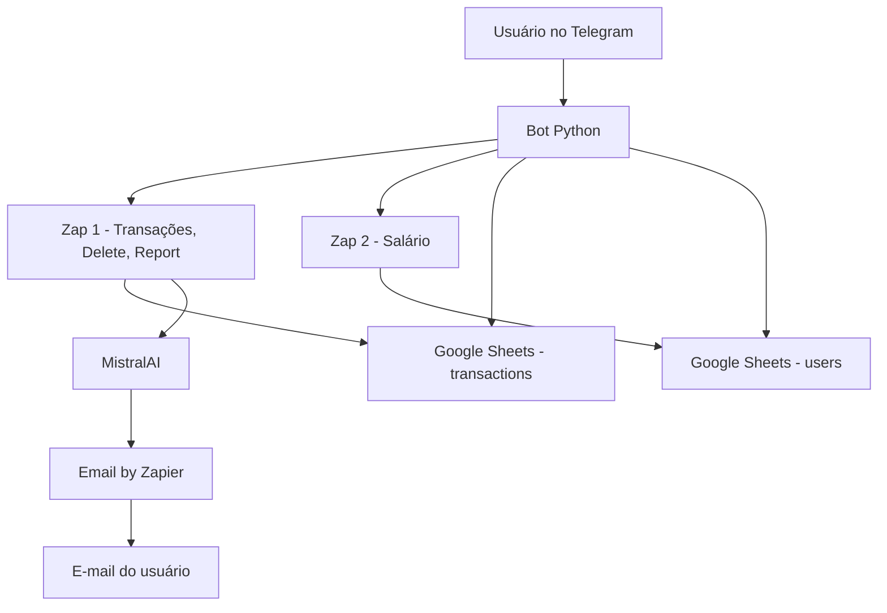
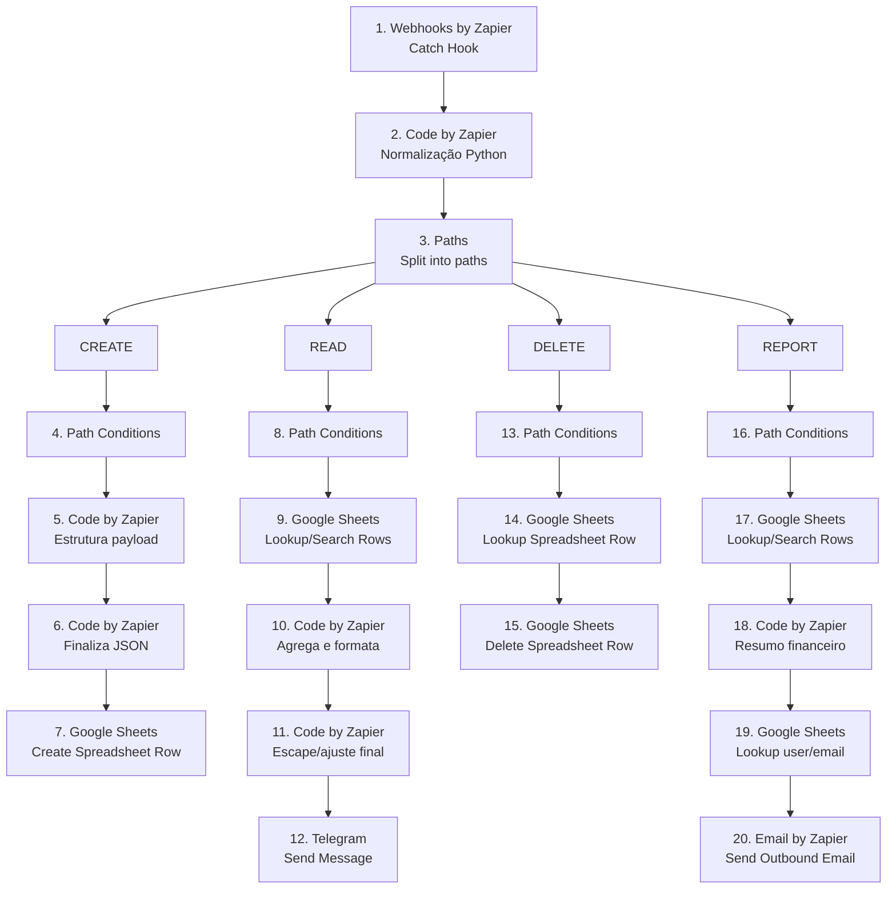
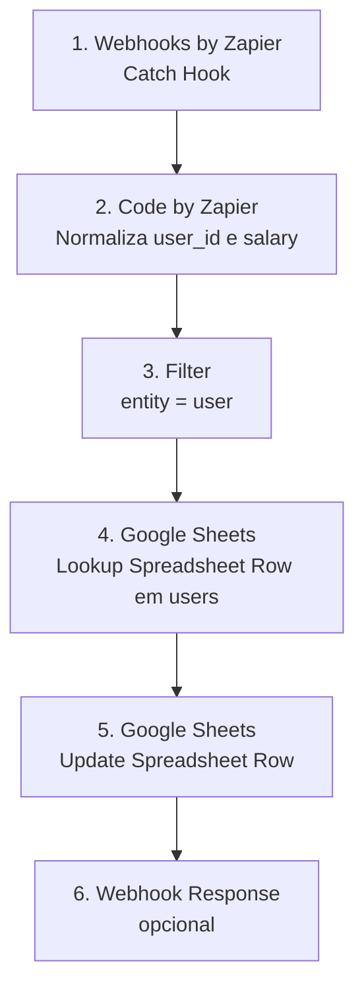

# 🤖 FinBot — Assistente Financeiro no Telegram

O **FinBot** é um assistente financeiro pessoal via Telegram para registrar despesas, receitas, consultar histórico, atualizar salário, excluir transações e receber um relatório financeiro mensal com análise por IA.

O projeto usa:

- **Python** para o bot do Telegram;
- **Google Sheets** como persistência inicial;
- **Zapier** para automações;
- **MistralAI** no relatório financeiro inteligente;
- **Email by Zapier** para envio do relatório mensal.

---

## ✨ Funcionalidades

- Onboarding inicial com e-mail e salário.
- Registro rápido de transações pelo Telegram.
- Suporte a despesas e receitas.
- Campo opcional de detalhes usando `|`.
- Histórico paginado no Telegram.
- Resumo mensal com salário, entradas, gastos e saldo.
- Exclusão de transações pelo menu.
- Atualização de salário via Zap separado.
- Relatório financeiro mensal por e-mail com análise da MistralAI.

---

## 🧱 Arquitetura



### Divisão de responsabilidades

| Camada | Responsabilidade |
|---|---|
| Bot Telegram | Interface, menus, confirmação, leitura direta e disparo dos Zaps |
| Zap 1 | CREATE, READ legado, DELETE e REPORT com IA |
| Zap 2 | Atualização de salário na aba `users` |
| Google Sheets | Persistência de usuários e transações |
| MistralAI | Geração da análise financeira textual |
| Email by Zapier | Envio do relatório mensal |


---

## 🔁 Estrutura dos Zaps no Zapier

O projeto usa **dois Zaps separados** para reduzir ambiguidade e evitar que salário, transações e relatórios sejam tratados pelo mesmo fluxo.

### Zap 1 — Transações, Histórico, Delete e Report

Este é o Zap principal. Ele recebe payloads do bot via webhook, normaliza os campos em Python e roteia a execução por `action`.



#### Ações suportadas no Zap 1

| Path | `action` | Responsabilidade | Saída esperada |
|---|---|---|---|
| 🟢 CREATE | `create` | Criar uma transação na aba `transactions` | Nova linha no Google Sheets |
| 🔵 READ | `read` | Buscar transações do usuário | Mensagem no Telegram |
| 🔴 DELETE | `delete` | Remover uma transação pelo `transaction_id` | Linha removida do Google Sheets |
| 📊 REPORT | `report` | Gerar resumo financeiro por e-mail | E-mail enviado ao usuário |

#### Status do Report

O path **REPORT já envia e-mails**, mas atualmente funciona como um relatório financeiro básico: receitas, despesas, saldo, categorias e últimas transações.

A evolução planejada é transformar esse fluxo em um **relatório analítico com IA**, onde o Zap deverá:

- ler as transações do usuário;
- ler salário e e-mail na aba `users`;
- cruzar gastos, entradas, categorias e recorrência;
- identificar padrões de comportamento;
- apontar incoerências financeiras, como alto gasto em delivery apesar de mercado elevado;
- sugerir cortes com justificativa contextual;
- gerar um texto mais consultivo, não apenas um resumo numérico.

Exemplo de insight desejado:

> O usuário gastou R$ 1.000 em supermercado, mas também R$ 600 em delivery. Isso pode indicar compra doméstica mal planejada, desperdício ou uso de delivery por conveniência. O relatório deve sugerir reduzir delivery antes de cortar gastos essenciais.

> **Status:** a parte de envio de e-mail existe; a análise comportamental com IA ainda não foi implementada.

---

### Zap 2 — Atualização de Salário

O Zap 2 deve ser **linear e isolado**. Ele não deve ter múltiplos paths, não deve processar transações e não deve executar IA.



#### Regra importante

O **Path B antigo do Zap 2 não deve existir mais**. O Zap 2 deve atualizar apenas a aba `users`, usando:

| Campo | Uso |
|---|---|
| `user_id` | chave de busca na aba `users` |
| `salary` | valor atualizado na coluna de salário |
| `updated_at` | data/hora da atualização |

O Zap 2 **não deve mapear** campos de transação como `description`, `category`, `amount`, `type` ou `transaction_id`.

---

### Divisão de responsabilidades

| Camada | Responsabilidade |
|---|---|
| Telegram Bot | Interface, menus, confirmação, leitura direta com `gspread` e envio para webhooks |
| Zap 1 | CRUD de transações, delete, histórico via Telegram e report por e-mail |
| Zap 2 | Atualização simples de salário na aba `users` |
| Google Sheets | Persistência das abas `transactions` e `users` |
| IA futura | Análise comportamental do report mensal |

---

## 📊 Estrutura do Google Sheets

### Aba `transactions`

| Coluna | Campo | Descrição |
|---|---|---|
| A | `id` | ID único da transação |
| B | `user_id` | ID do usuário no Telegram |
| C | `date` | Data da transação |
| D | `description` | Descrição curta |
| E | `category` | Categoria |
| F | `amount` | Valor |
| G | `type` | `expense` ou `income` |
| H | `created_at` | Data de criação |
| I | `updated_at` | Data de atualização |
| J | `details` | Observações adicionais |

### Aba `users`

| Coluna | Campo | Descrição |
|---|---|---|
| A | `user_id` | ID do usuário no Telegram |
| B | `email` | E-mail para relatório |
| C | `registered_date` | Data de cadastro |
| D | `salary` | Salário base |
| E | `updated_at` | Última atualização |

---

## 🔁 Fluxos principais

## 1. Onboarding

Ao usar `/start`, o bot verifica se o usuário já existe na aba `users`.

Se não existir ou não tiver salário válido:

```text
/start
→ pedir e-mail
→ pedir salário
→ salvar usuário na aba users
→ liberar menu principal
```

---

## 2. Registro de transação

O usuário pode registrar pelo comando:

```text
/registro mercado 84
```

Ou com detalhes:

```text
/registro mercado 84 | compra semanal com arroz e carne
```

O bot extrai:

| Campo | Exemplo |
|---|---|
| `description` | mercado |
| `amount` | 84 |
| `details` | compra semanal com arroz e carne |
| `category` | Compras |
| `type` | expense |

Depois envia para o **Zap 1** com `action=create`.

---

## 3. Histórico

O histórico é lido diretamente pelo bot via `gspread`.

```text
Bot
→ lê aba transactions
→ filtra por user_id
→ pagina resultados
→ mostra no Telegram
```

O Path READ do Zap 1 pode existir como fluxo legado/complementar, mas a leitura principal atual é feita pelo bot.

---

## 4. Deletar transação

Fluxo:

```text
Usuário clica em "🗑️ Deletar Transação"
→ Bot mostra últimas transações
→ Usuário seleciona uma
→ Bot envia action=delete para Zap 1
→ Zap 1 busca por transaction_id
→ Zap 1 remove linha no Google Sheets
```

Payload:

```json
{
  "action": "delete",
  "user_id": "7500965215",
  "transaction_id": "7500965215_20260502120000",
  "_source": "telegram_bot",
  "_timestamp": "2026-05-02T12:00:00"
}
```

---

## 5. Salário

A atualização de salário pertence exclusivamente ao **Zap 2**.

Payload enviado pelo bot:

```json
{
  "action": "update_salary",
  "user_id": "7500965215",
  "salary": 13000.0,
  "_source": "telegram_bot",
  "_timestamp": "2026-05-02T12:00:00"
}
```

O Zap 2:

```text
Webhook
→ Code Step normaliza user_id/salary
→ Filter entity=user
→ Lookup na aba users
→ Update salary e updated_at
```

O Zap 2 não deve processar transações, DELETE, READ ou REPORT.

---

## 6. Relatório financeiro com IA

O relatório é a principal feature inteligente do projeto.

Fluxo atual:

```text
Bot Telegram
→ action=report para Zap 1
→ Zap 1 busca usuário na aba users
→ Zap 1 busca transações na aba transactions
→ Code Step consolida dados
→ MistralAI gera análise
→ Code Step formata e-mail
→ Email by Zapier envia relatório
```

Payload enviado pelo bot:

```json
{
  "action": "report",
  "user_id": "7500965215",
  "_source": "telegram_bot",
  "_timestamp": "2026-05-02T12:00:00"
}
```

O relatório por IA gera:

- diagnóstico do mês;
- resumo de receitas, despesas e saldo;
- análise por categoria;
- sinais de alerta;
- padrões comportamentais;
- plano de ação;
- recomendações práticas;
- veredito final.

### Pontos críticos do REPORT

No Step 19, as transações devem ser mapeadas por line-items separados:

| Input do Step 19 | Campo do Step 18 |
|---|---|
| `tx_ids` | `COL$A` |
| `tx_user_ids` | `COL$B` |
| `tx_dates` | `COL$C` |
| `tx_descriptions` | `COL$D` |
| `tx_categories` | `COL$E` |
| `tx_amounts` | `COL$F` |
| `tx_types` | `COL$G` |
| `tx_details` | `COL$J` |

No Step 21, o conteúdo da IA deve vir de:

```text
20. Choices Message Content
```

ou:

```text
20. Choices Messages Content
```

Não usar status code, headers ou request body como resposta da IA.

---

## 🏷️ Categorias

Categorias principais:

- Alimentação
- Transporte
- Entretenimento
- Saúde
- Educação
- Moradia
- Compras
- Gastos de Urgências
- Outros

O bot usa keyword matching para sugerir categoria e tipo.

Exemplos:

| Texto | Categoria | Tipo |
|---|---|---|
| `ifood 39` | Alimentação | expense |
| `uber 25` | Transporte | expense |
| `mercado 300` | Compras | expense |
| `curso 100` | Educação | expense |
| `freelance 800` | Trabalho | income |
| `salário 3500` | Trabalho | income |

---

## ⚙️ Instalação

## Requisitos

- Python 3.10+
- Conta de serviço do Google Cloud com acesso ao Google Sheets
- Planilha com abas `transactions` e `users`
- 2 Webhooks no Zapier
- Chave da MistralAI para o REPORT

## Instalar dependências

```bash
pip install -r requirements.txt
```

Dependências principais:

```text
python-telegram-bot
requests
python-dotenv
gspread
google-auth
```

---

## 🔐 Variáveis de ambiente

Crie um arquivo `.env`:

```bash
TELEGRAM_BOT_TOKEN=seu_token_do_telegram

ZAPIER_WEBHOOK_EXPENSE=url_do_zap_1
ZAPIER_WEBHOOK_SALARY=url_do_zap_2

GOOGLE_SHEET_ID=id_da_planilha
GOOGLE_CREDENTIALS_PATH=caminho/para/credentials.json

SHEET_NAME=transactions
USERS_SHEET_NAME=users
```

Em produção/cloud, pode usar:

```bash
GOOGLE_CREDENTIALS_JSON='{"type":"service_account",...}'
```

Use **uma** das duas opções:

- `GOOGLE_CREDENTIALS_PATH` para ambiente local;
- `GOOGLE_CREDENTIALS_JSON` para Railway/Render/cloud.

---

## ▶️ Execução local

```bash
python finbot_telegram.py
```

O bot roda em polling.

> Importante: mantenha apenas uma instância do polling ativa para evitar conflito de updates no Telegram.

---

## 🚀 Deploy

Para deploy em Railway, Render ou serviço similar:

1. Configure as variáveis de ambiente.
2. Use o comando:

```bash
python finbot_telegram.py
```

3. Garanta que o Google Sheets esteja compartilhado com o e-mail da Service Account.
4. Garanta que os webhooks do Zapier estejam publicados.

---

## 🧪 Checklist de validação

### Bot

- [ ] `/start` inicia onboarding.
- [ ] E-mail é salvo corretamente.
- [ ] Salário é salvo corretamente.
- [ ] Menu principal aparece após cadastro.
- [ ] `/registro mercado 84` cria transação.
- [ ] `/registro mercado 84 | compra semanal` salva `details`.
- [ ] Histórico mostra transações do usuário correto.
- [ ] Delete remove a transação selecionada.
- [ ] Salário mostra saldo mensal correto.
- [ ] Relatório dispara `action=report`.

### Zap 1

- [ ] `create` cria linha em `transactions`.
- [ ] `delete` remove linha por `transaction_id`.
- [ ] `report` busca usuário na aba `users`.
- [ ] `report` busca transações por `user_id`.
- [ ] Step 19 calcula `expense_total` corretamente.
- [ ] Step 20 retorna conteúdo da MistralAI.
- [ ] Step 21 usa `Choices Message Content`.
- [ ] Step 22 envia e-mail com análise da IA.

### Zap 2

- [ ] Atualiza somente `salary` e `updated_at`.
- [ ] Não cria usuário duplicado.
- [ ] Não processa transações.
- [ ] Não possui paths extras.

---

## 🧯 Problemas comuns

### Relatório chega como fallback

Sintoma:

```text
Relatório Financeiro - Indisponível
```

Correção:

- Conferir se o Step 20 retornou `Choices Message Content`.
- Mapear `response` ou `ai_content` do Step 21 para `20. Choices Message Content`.

---

### REPORT mostra despesas zeradas

Sintoma:

```text
expense_total = 0
balance = salary
```

Correção:

- Conferir se Step 18 busca `transactions` por `user_id` / `COL$B`.
- Conferir se Step 19 recebe `tx_dates`, `tx_amounts`, `tx_types` etc.
- Não depender de `18. Results` se o formato vier incompatível.

---

### Erro `SyntaxError: invalid syntax` com `18. COL$A`

Causa:

O mapeamento visual do Zapier foi colado dentro do código Python.

Errado:

```python
tx_ids = 18. COL$A
```

Certo no código:

```python
tx_ids = split_line_items(input_data.get("tx_ids"))
```

Certo na interface do Zapier:

```text
tx_ids → 18. COL$A
```

---

### Salário cria linha duplicada

Correção no Zap 2:

- `Create if not found`: desativado.
- Lookup por `user_id`.
- Update apenas em `salary` e `updated_at`.

---

## ⚠️ Segurança

- Não commitar `.env`.
- Não commitar credenciais JSON.
- Não expor URLs reais dos webhooks.
- Não expor chave da MistralAI.
- Evitar logs com e-mail, salário ou transações completas em produção.
- Webhooks do Zapier são públicos; futuramente adicionar token simples de validação.

---

## 📁 Documentos auxiliares

- `zap1_funcionamento.md` — detalhes completos do Zap 1.
- `zap_2_funcionamento.md` — detalhes do Zap 2.
- `telegram_bot_spec_atualizado.md` — especificação técnica do bot.
- `README.md` — visão geral e instruções de uso.

---

## 📌 Status atual

| Área | Status |
|---|---|
| Bot Telegram | Funcional |
| Onboarding | Funcional |
| Registro de transações | Funcional |
| Details em transações | Funcional |
| Histórico | Funcional |
| Delete | Funcional |
| Salário | Funcional |
| REPORT com MistralAI | Funcional |
| E-mail com análise IA | Funcional |
| Proteção robusta de webhook | Pendente |
| Migração para banco real | Futuro |

---

## 📝 Licença

Projeto pessoal/educacional. Ajuste conforme o uso pretendido.
