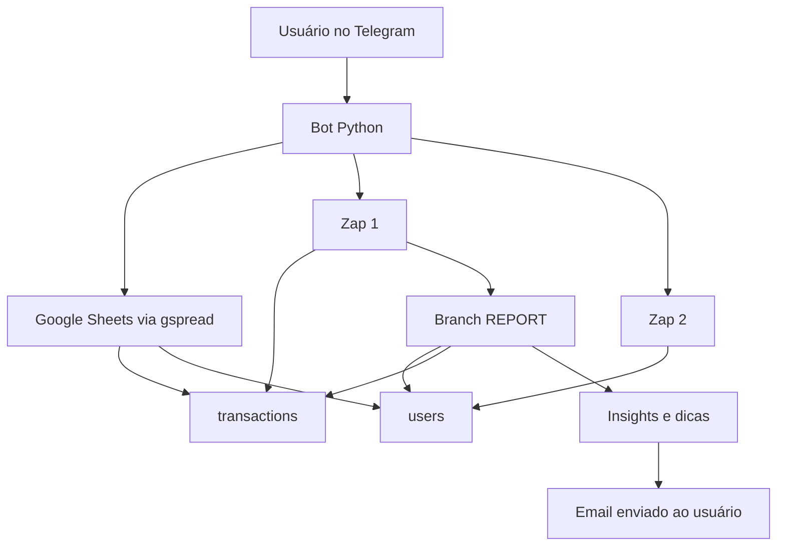
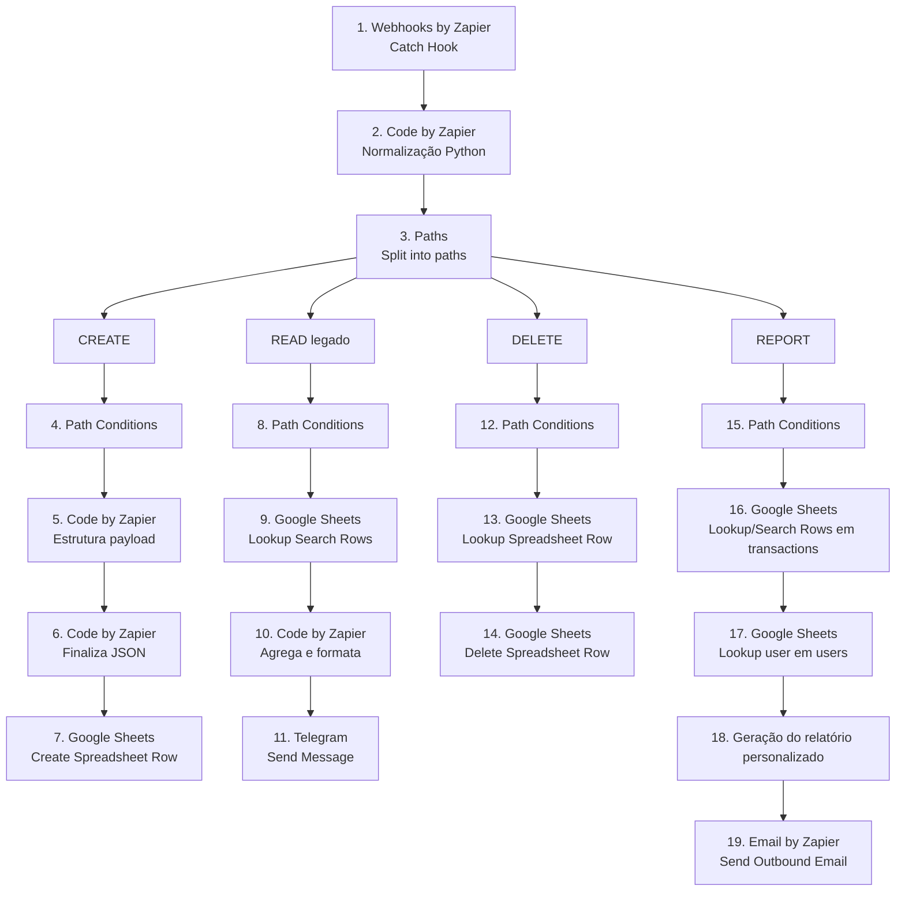
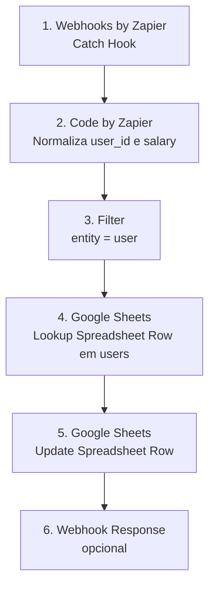

# 🤖 FinBot — Assistente Financeiro no Telegram

O **FinBot** é um bot de finanças pessoais via Telegram. Hoje ele permite fazer onboarding com e-mail e salário, registrar transações, consultar histórico, ver um resumo mensal e gerar um relatório personalizado por e-mail.

O comportamento real do projeto hoje é:

- **Python** para o bot Telegram.
- **Google Sheets** como persistência das abas `transactions` e `users`.
- **Zap 1** para criar transações, deletar transações e gerar o relatório personalizado.
- **Zap 2** para atualizar salário na aba `users`.
- **Leitura direta com `gspread`** para histórico, verificação de onboarding, salário e resumo do mês.

## ✨ Funcionalidades atuais

- Onboarding inicial com e-mail e salário.
- Registro rápido de transações via `/registro`.
- Suporte a gastos e recebimentos.
- Campo opcional de observação usando `|`.
- Histórico paginado no Telegram.
- Resumo mensal com salário, entradas, gastos e saldo disponível.
- Exclusão de transações pelo menu.
- Atualização de salário via Zap separado.
- Relatório financeiro personalizado por e-mail com base no salário e nas transações mensais do usuário.

## 🧱 Arquitetura

### Sistema completo



### Zap 1

O relatório sai da branch `REPORT` do Zap 1.



### Zap 2



## Comandos implementados no código

- `/start`
- `/registro`
- `/historico`
- `/salario`
- `/relatorio`

## Fluxo principal

### 1. Onboarding

Ao usar `/start`, o bot verifica se o `user_id` já existe na aba `users` e se já possui salário válido.

Se não existir ou estiver sem salário:

```text
/start
→ pedir e-mail
→ validar e-mail
→ pedir salário
→ salvar ou atualizar usuário na aba users via gspread
→ liberar menu principal
```

### 2. Registro de transação

Exemplos:

```text
/registro ifood 39
/registro mercado 84 | compra do mês
/registro freelance 800 | projeto abril
```

O bot:

- extrai `description`, `amount` e `details`;
- detecta `category` e `type`;
- mostra confirmação;
- ao confirmar, envia o payload para o **Zap 1** com `action=create`.

### 3. Histórico

O histórico atual **não depende do Zap 1**. O próprio bot:

```text
→ lê a aba transactions com gspread
→ filtra por user_id exato
→ pagina os resultados
→ exibe no Telegram
```

### 4. Resumo mensal

Ao abrir o menu de dinheiro/salário, o bot:

```text
→ lê salary na aba users
→ lê transactions do mês atual
→ soma entradas e gastos
→ calcula saldo disponível
```

Fórmula usada hoje:

```text
saldo disponível = salário registrado + entradas do mês - gastos do mês
```

### 5. Deleção de transação

Fluxo:

```text
Usuário clica em "Deletar Transação"
→ Bot mostra até 10 transações recentes do próprio usuário
→ Usuário seleciona uma
→ Bot confirma a escolha
→ Bot envia action=delete para o Zap 1
→ Zap 1 remove a linha no Google Sheets
```

### 6. Relatório por e-mail

O relatório atual é personalizado com base no salário e nas transações mensais do usuário, trazendo insights, dicas e apontamentos enviados para o e-mail cadastrado.

No desenho atual do sistema:

- o bot envia a solicitação com `action=report`;
- a branch `REPORT` do Zap 1 continua o processamento;
- o relatório final é gerado e enviado por e-mail.

Se o webhook responder com sucesso, o usuário recebe a confirmação:

```text
Relatório solicitado
→ branch REPORT do Zap 1 continua o fluxo
→ relatório personalizado é enviado ao e-mail cadastrado
```

## 📊 Estrutura do Google Sheets

### Aba `transactions`

| Coluna | Campo | Descrição |
|---|---|---|
| A | `id` | ID único da transação |
| B | `user_id` | ID do usuário no Telegram |
| C | `date` | Data da transação |
| D | `description` | Descrição curta |
| E | `category` | Categoria |
| F | `amount` | Valor |
| G | `type` | `expense` ou `income` |
| H | `created_at` | Data de criação |
| I | `updated_at` | Data de atualização |
| J | `details` | Observações adicionais |

### Aba `users`

| Coluna | Campo | Descrição |
|---|---|---|
| A | `user_id` | ID do usuário no Telegram |
| B | `email` | E-mail para relatório |
| C | `registered_date` | Data de cadastro |
| D | `salary` | Salário base |
| E | `updated_at` | Última atualização |

## 🏷️ Categorias atuais

O bot usa keyword matching local para sugerir categoria e tipo.

| Exemplo | Categoria | Tipo |
|---|---|---|
| `ifood 39` | Alimentação | expense |
| `uber 25` | Transporte | expense |
| `mercado 300` | Compras | expense |
| `curso 100` | Educação | expense |
| `freelance 800` | Trabalho | income |
| `salário 3500` | Trabalho | income |
| sem match | Outros | expense |

## 🔐 Variáveis de ambiente

Crie um `.env` com:

```bash
TELEGRAM_BOT_TOKEN=seu_token

ZAPIER_WEBHOOK_EXPENSE=url_do_zap_1
ZAPIER_WEBHOOK_SALARY=url_do_zap_2

GOOGLE_SHEET_ID=id_da_planilha
GOOGLE_CREDENTIALS_PATH=caminho/para/credentials.json

SHEET_NAME=transactions
USERS_SHEET_NAME=users
```

Em produção/cloud, o bot também aceita:

```bash
GOOGLE_CREDENTIALS_JSON='{"type":"service_account",...}'
```

É necessário usar **uma** destas opções:

- `GOOGLE_CREDENTIALS_PATH`
- `GOOGLE_CREDENTIALS_JSON`

## ⚙️ Instalação

### Requisitos

- Python 3.10+
- Planilha com abas `transactions` e `users`
- Conta de serviço do Google com acesso à planilha
- 2 webhooks no Zapier

### Dependências

```bash
pip install -r requirements.txt
```

Dependências atuais do repositório:

```text
python-telegram-bot==21.1
requests==2.31.0
python-dotenv==1.0.0
gspread==5.12.0
```

## ▶️ Execução local

```bash
python3 finbot_telegram.py
```

O bot roda em polling.

## 🚀 Deploy

O `Procfile` atual usa:

```text
worker: python finbot_telegram.py
```

Para subir em Railway, Render ou similar:

1. Configure as variáveis de ambiente.
2. Garanta que a planilha esteja compartilhada com a service account.
3. Garanta que os webhooks do Zapier estejam publicados.
4. Rode uma única instância do polling.

## ⚠️ Lacunas e problemas atuais

- O relatório é disparado pelo bot, mas sua geração final depende da branch `REPORT` do Zap 1; este repositório cobre o disparo e o contrato do payload, não a implementação interna do e-mail.
- O estado da conversa fica em memória em `context.user_data`; um restart interrompe fluxos em andamento.
- Há logs de debug bem verbosos no runtime atual, inclusive com sinais de configuração e rastreamento detalhado de Sheets.
- Os webhooks do Zapier continuam sendo pontos sensíveis e precisam de proteção operacional adequada.
- O alias `/dinheiro` aparece registrado no `main()`, mas a função correspondente não existe no arquivo atual. Este README não documenta esse comando como funcional.
