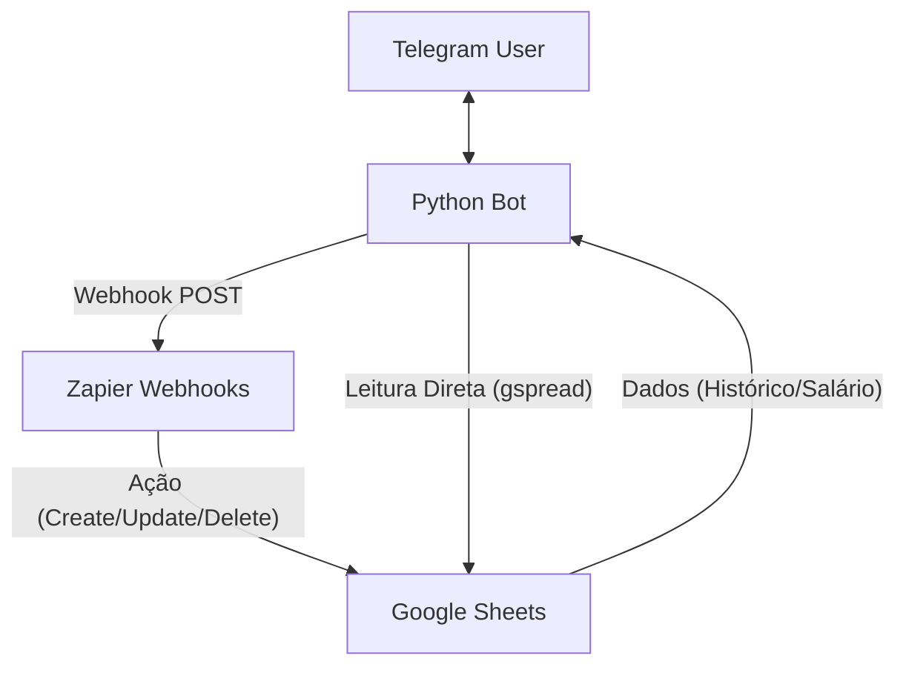
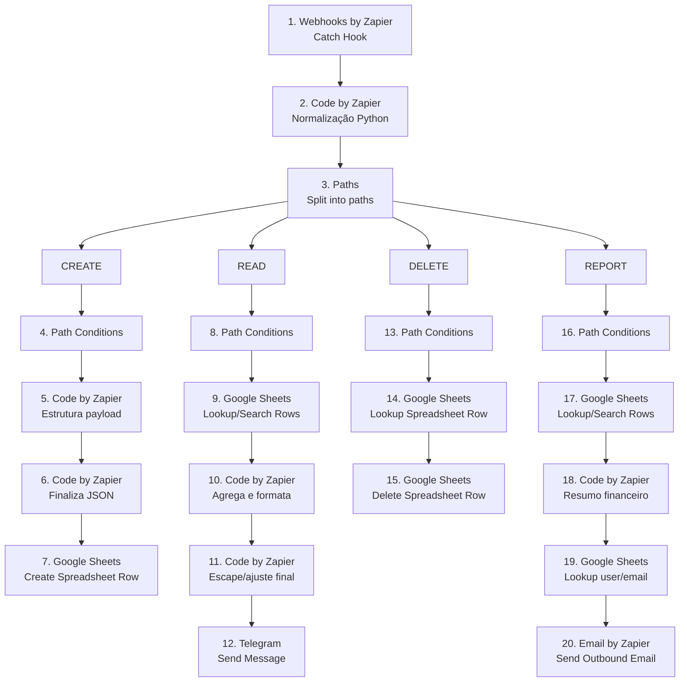
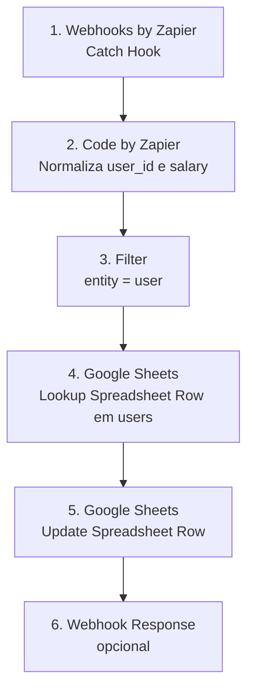

# 🤖 FinBot — Seu Assistente Financeiro Inteligente

<p align="center">
  
  
  
  
</p>

O **FinBot** é um assistente financeiro poderoso que vive no seu Telegram. Ele combina a simplicidade de mensagens de chat com a robustez do Google Sheets e automação do Zapier para ajudar você a manter suas finanças sob controle sem esforço.

---

## ✨ Principais Funcionalidades

*   🚀 **Onboarding Obrigatório**: Cadastro simples de e-mail e salário no primeiro uso.
*   💸 **Registro Ultrarrápido**: Use `/registro café 5` e pronto! O bot cuida da categoria e data.
*   📈 **Cálculo de Saldo em Tempo Real**: `Saldo = Salário + Entradas - Gastos`. Sempre atualizado.
*   📥 **Suporte a Receitas e Despesas**: Identificação inteligente de PIX recebidos, freelance, vendas, etc.
*   📊 **Histórico Paginado**: Veja suas últimas transações sem sair do Telegram.
*   🗑️ **Exclusão de Transações**: Interface intuitiva para remover registros incorretos.
*   📋 **Normalização Inteligente**: Aceita valores como `R$ 50,00`, `50.00` ou `50` e datas em múltiplos formatos (incluindo serial do Excel).

---

## 🏗️ Arquitetura do Sistema

O FinBot utiliza uma arquitetura híbrida para garantir velocidade e confiabilidade:



### Onde os dados moram:
1.  **Aba `transactions`**: Todas as suas movimentações financeiras.
2.  **Aba `users`**: Seus dados de perfil, e-mail e salário base.


---

## 🔁 Estrutura dos Zaps no Zapier

O projeto usa **dois Zaps separados** para reduzir ambiguidade e evitar que salário, transações e relatórios sejam tratados pelo mesmo fluxo.

### Zap 1 — Transações, Histórico, Delete e Report

Este é o Zap principal. Ele recebe payloads do bot via webhook, normaliza os campos em Python e roteia a execução por `action`.



#### Ações suportadas no Zap 1

| Path | `action` | Responsabilidade | Saída esperada |
|---|---|---|---|
| 🟢 CREATE | `create` | Criar uma transação na aba `transactions` | Nova linha no Google Sheets |
| 🔵 READ | `read` | Buscar transações do usuário | Mensagem no Telegram |
| 🔴 DELETE | `delete` | Remover uma transação pelo `transaction_id` | Linha removida do Google Sheets |
| 📊 REPORT | `report` | Gerar resumo financeiro por e-mail | E-mail enviado ao usuário |

#### Status do Report

O path **REPORT já envia e-mails**, mas atualmente funciona como um relatório financeiro básico: receitas, despesas, saldo, categorias e últimas transações.

A evolução planejada é transformar esse fluxo em um **relatório analítico com IA**, onde o Zap deverá:

- ler as transações do usuário;
- ler salário e e-mail na aba `users`;
- cruzar gastos, entradas, categorias e recorrência;
- identificar padrões de comportamento;
- apontar incoerências financeiras, como alto gasto em delivery apesar de mercado elevado;
- sugerir cortes com justificativa contextual;
- gerar um texto mais consultivo, não apenas um resumo numérico.

Exemplo de insight desejado:

> O usuário gastou R$ 1.000 em supermercado, mas também R$ 600 em delivery. Isso pode indicar compra doméstica mal planejada, desperdício ou uso de delivery por conveniência. O relatório deve sugerir reduzir delivery antes de cortar gastos essenciais.

> **Status:** a parte de envio de e-mail existe; a análise comportamental com IA ainda não foi implementada.

---

### Zap 2 — Atualização de Salário

O Zap 2 deve ser **linear e isolado**. Ele não deve ter múltiplos paths, não deve processar transações e não deve executar IA.



#### Regra importante

O **Path B antigo do Zap 2 não deve existir mais**. O Zap 2 deve atualizar apenas a aba `users`, usando:

| Campo | Uso |
|---|---|
| `user_id` | chave de busca na aba `users` |
| `salary` | valor atualizado na coluna de salário |
| `updated_at` | data/hora da atualização |

O Zap 2 **não deve mapear** campos de transação como `description`, `category`, `amount`, `type` ou `transaction_id`.

---

### Divisão de responsabilidades

| Camada | Responsabilidade |
|---|---|
| Telegram Bot | Interface, menus, confirmação, leitura direta com `gspread` e envio para webhooks |
| Zap 1 | CRUD de transações, delete, histórico via Telegram e report por e-mail |
| Zap 2 | Atualização simples de salário na aba `users` |
| Google Sheets | Persistência das abas `transactions` e `users` |
| IA futura | Análise comportamental do report mensal |

---

## 📱 Guia de Uso

### 🆕 Primeiro Acesso (Onboarding)
Ao enviar `/start` pela primeira vez, o bot guiará você:
1.  **E-mail**: Informe seu e-mail para contato/relatórios.
2.  **Salário**: Informe quanto você ganha por mês.
*O acesso ao menu principal só é liberado após concluir estes passos.*

### 💵 Resumo Financeiro (`/salario`)
O bot exibe um resumo completo do seu mês:
> 💵 **Resumo do Mês**
> 
> 💰 Salário registrado: R$ 5.000,00
> 📥 Entradas este mês: R$ 800,00
> 💸 Gastos do mês: R$ 1.200,00
> 🟢 Saldo disponível: R$ 4.600,00

---

## 🏷️ Categorização Inteligente (Keywords)

O bot detecta automaticamente o tipo e categoria com base no que você escreve:

| Tipo | Categoria | Keywords Exemplos |
| :--- | :--- | :--- |
| **Gasto** | Alimentação | `ifood, burger king, restaurante, mercado` |
| **Gasto** | Transporte | `uber, 99, gasolina, metro` |
| **Receita** | Trabalho | `salário, pix recebido, freelance, venda` |
| **Gasto** | Saúde | `farmácia, médico, dentista` |

---

## ⚙️ Configuração e Instalação

### 1. Requisitos
*   Python 3.10+
*   Google Cloud Service Account (JSON)
*   2 Webhooks no Zapier (Zap 1: Transações, Zap 2: Salário)

### 2. Variáveis de Ambiente (`.env`)
```bash
TELEGRAM_BOT_TOKEN=seu_token_aqui
ZAPIER_WEBHOOK_EXPENSE=url_do_zap_1
ZAPIER_WEBHOOK_SALARY=url_do_zap_2
GOOGLE_SHEET_ID=id_da_planilha
GOOGLE_CREDENTIALS_PATH=caminho/para/credentials.json
# USERS_SHEET_NAME=users (opcional)
```

### 3. Execução
```bash
pip install -r requirements.txt
python finbot_telegram.py
```

---

## 🚢 Deploy no Railway / Cloud

Para deploy em nuvem, você pode usar a variável `GOOGLE_CREDENTIALS_JSON` colando o conteúdo do seu arquivo JSON de credenciais. O bot tratará automaticamente as quebras de linha da chave privada.

```
worker: python finbot_telegram.py
```

---

## 📝 Licença
Este projeto é de uso livre. Sinta-se à vontade para clonar e adaptar para suas necessidades financeiras! 🚀
