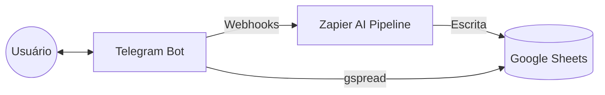

# FinBot Telegram Assistant — Especificação Técnica Atualizada

**Projeto:** Assistente financeiro com IA integrado ao Telegram e Zapier
**Status:** Implementado (Onboarding + Dual Zapier integration + Direct Sheets Reading)
**Última Atualização:** Abril 2026

---

## 1. Visão Geral da Arquitetura

O FinBot atua como uma interface inteligente para o Google Sheets, utilizando o Zapier como motor de escrita assíncrona (com IA) e o `gspread` para leitura síncrona de alta performance.

---

## 2. Fluxo de Onboarding (Novo)

Para garantir que cada usuário tenha um perfil completo, implementamos um fluxo de boas-vindas obrigatório.

1.  **Detecção**: Ao enviar `/start`, o bot consulta a aba `users`.
2.  **Verificação**: Se o `user_id` não existir ou se os campos `email` ou `salary` estiverem vazios.
3.  **Estados**:
    *   `AWAITING_EMAIL`: Valida formato de e-mail via Regex.
    *   `AWAITING_ONBOARDING_SALARY`: Valida e normaliza o salário inicial.
4.  **Persistência**: Grava/Atualiza a linha na aba `users` com `registered_date` e `updated_at`.

---

## 3. Lógica de Cálculo Financeiro

Diferente de versões anteriores, o saldo é agora calculado dinamicamente em tempo real para evitar inconsistências.

### 3.1 Fórmula do Saldo
`Saldo Disponível = Salário (aba users) + Entradas do Mês (aba transactions) - Gastos do Mês (aba transactions)`

### 3.2 Normalização de Dados (`get_monthly_summary`)
A função de resumo agora é extremamente resiliente:
*   **Tipos de Gastos**: `expense, gasto, despesa, saida, saída`.
*   **Tipos de Receitas**: `income, receita, entrada, recebido, freelance, venda, pix recebido`.
*   **Valores**: O bot limpa `R$`, trata pontos e vírgulas (ex: `1.234,56` vira `1234.56`).
*   **Datas**: Suporta datas ISO, formato brasileiro e o formato serial numérico do Google Sheets (ex: `46141`).

---

## 4. Máquina de Estados (Conversation Handler)

O bot utiliza estados para gerenciar interações complexas:

| Estado | Descrição |
| :--- | :--- |
| `MENU` | Estado base (menu principal) |
| `AWAITING_EMAIL` | Captura de e-mail (Onboarding) |
| `AWAITING_ONBOARDING_SALARY` | Captura de salário inicial (Onboarding) |
| `AWAITING_EXPENSE` | Aguardando descrição/valor para novo registro |
| `CONFIRMING` | Aguardando confirmação (Confirmar/Editar) |
| `AWAITING_SALARY` | Atualização de salário via menu |

---

## 5. Estrutura de Dados (Google Sheets)

### Aba: `users`
| Coluna | Descrição |
| :--- | :--- |
| `user_id` | ID numérico fixo do Telegram (string) |
| `email` | E-mail validado do usuário |
| `registered_date` | Data do primeiro cadastro |
| `salary` | Valor numérico do salário base |
| `updated_at` | Timestamp da última atualização |

### Aba: `transactions`
| Coluna | Descrição |
| :--- | :--- |
| `id` | ID único (`user_id + timestamp`) |
| `user_id` | Dono da transação (Filtro Principal) |
| `date` | Data da movimentação |
| `description` | Descrição do item |
| `category` | Categoria detectada |
| `amount` | Valor numérico |
| `type` | `expense` ou `income` |

---

## 6. Segurança e Conectividade

*   **Chaves Privadas**: O bot detecta automaticamente chaves do Google Service Account em variáveis de ambiente e corrige escapes de quebra de linha (`\\n`).
*   **Identificação**: O filtro é feito estritamente pela coluna `user_id`, garantindo que um usuário nunca veja dados de outro, mesmo que as transações tenham IDs sequenciais.
